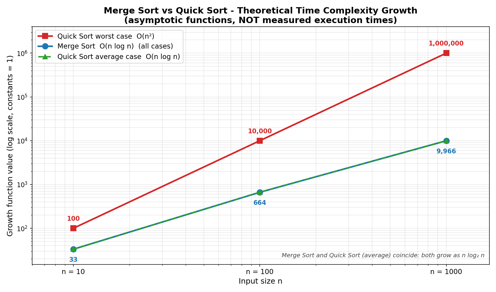

# Project 1 – Sorting Complexity Visualizer

## Unit
**Unit I – Algorithm Analysis** (asymptotic notation, time-complexity comparison)

## Description
This project compares the time complexity of two classic divide-and-conquer sorting algorithms, **Merge Sort** and **Quick Sort**, for input sizes n = 10, 100 and 1000. The Python program contains working implementations of both sorts (verified for correctness), prints a table of their theoretical growth functions, and draws a line chart of that growth.

> **Important:** the chart shows **theoretical / asymptotic complexity** (the functions n·log₂n and n², constant factors set to 1). It is **not** a set of measured execution times or benchmarks.

## Problem Statement
Generate a graph comparing the time complexity of Merge Sort and Quick Sort for n = 10, 100, 1000.

## Algorithm
**Merge Sort** – split the array into two halves, sort each half recursively, then merge the two sorted halves. Recurrence: `T(n) = 2T(n/2) + O(n)` → `O(n log n)` in the best, average and worst case.

**Quick Sort** – choose a pivot, partition the array so smaller elements lie left of the pivot and larger ones right, then sort both parts recursively.
* Average case (balanced partitions): `T(n) = 2T(n/2) + O(n)` → `O(n log n)`
* Worst case (already-sorted input with a poor pivot): `T(n) = T(n−1) + O(n)` → `O(n²)`

## Pseudocode
```
MERGE-SORT(A):
    if length(A) <= 1: return A
    mid   <- length(A) / 2
    left  <- MERGE-SORT(A[0..mid-1])
    right <- MERGE-SORT(A[mid..end])
    return MERGE(left, right)          // linear-time merge

QUICK-SORT(A, lo, hi):
    if lo < hi:
        p <- PARTITION(A, lo, hi)      // pivot ends at index p
        QUICK-SORT(A, lo, p-1)
        QUICK-SORT(A, p+1, hi)

PLOT-COMPLEXITY():
    for n in {10, 100, 1000}:
        mergeSort(n)      <- n * log2(n)
        quickAverage(n)   <- n * log2(n)
        quickWorst(n)     <- n * n
    draw three lines on a log-log chart
```

## Input
Input sizes `n = 10, 100, 1000`. The program also generates random integer arrays of these sizes (seed 42) only to confirm that both sort implementations are correct.

## Output
```
Correctness check: Merge Sort and Quick Sort sorted all test inputs correctly.

Theoretical growth (constant factors = 1, NOT measured runtimes)
------------------------------------------------------------------------------
     n |       Merge Sort |   Quick Sort avg |   Quick Sort worst
       |         n log2 n |         n log2 n |                n^2
------------------------------------------------------------------------------
    10 |            33.22 |            33.22 |                100
   100 |           664.39 |           664.39 |             10,000
  1000 |         9,965.78 |         9,965.78 |          1,000,000
------------------------------------------------------------------------------
Worst/Average ratio at n=1000 : 100.3x
Chart saved to .../Visualization.png
```

## Prompt Used
The exact prompt used to generate the visualization is stored in [`Prompt.txt`](Prompt.txt). Summary: *"Create a clean line chart comparing the theoretical time complexity of Merge Sort O(n log n), Quick Sort average O(n log n) and Quick Sort worst case O(n²) for n = 10, 100, 1000; label it clearly as theoretical, not measured."*

## Visualization


## Visualization Explanation
* **Red line (Quick Sort worst case, O(n²))** rises from 100 to 1,000,000 – it grows 100× faster than the other curves at n = 1000.
* **Blue line (Merge Sort, O(n log n))** and **green dashed line (Quick Sort average, O(n log n))** lie exactly on top of each other: 33 → 664 → 9,966.
* Both axes use a **log scale**, otherwise the n² values would flatten the n log n curves to the bottom of the chart.
* Each point is annotated with its numeric value, and the title states that these are asymptotic growth functions, not benchmarks.

## Complexity Analysis
| Algorithm | Best | Average | Worst | Extra space |
|-----------|------|---------|-------|-------------|
| Merge Sort | O(n log n) | O(n log n) | O(n log n) | O(n) |
| Quick Sort | O(n log n) | O(n log n) | O(n²) | O(log n) stack (smaller side recursed first) |

Growth values used in the chart: `n·log₂n` = 33.22, 664.39, 9965.78 and `n²` = 100, 10,000, 1,000,000 for n = 10, 100, 1000.

## Learning Outcome
* Understand and apply Big-O notation to compare algorithms.
* Derive `O(n log n)` and `O(n²)` from the recurrence relations of divide-and-conquer sorts.
* Recognise that Quick Sort's average case is excellent but its worst case is quadratic, while Merge Sort is guaranteed `O(n log n)`.
* Interpret log-scale growth charts and distinguish theoretical complexity from measured runtime.

## How to Run
```bash
pip install matplotlib        # only needed for the chart
python Project1_SortingComplexity.py
```
The program prints the table and (re)creates `Visualization.png` in the same folder.

## Files
| File | Purpose |
|------|---------|
| `Project1_SortingComplexity.py` | Merge Sort / Quick Sort implementations, complexity table, chart generation |
| `Prompt.txt` | AI visualization prompt |
| `Visualization.png` | Generated complexity chart |
| `README.md` | This document |
