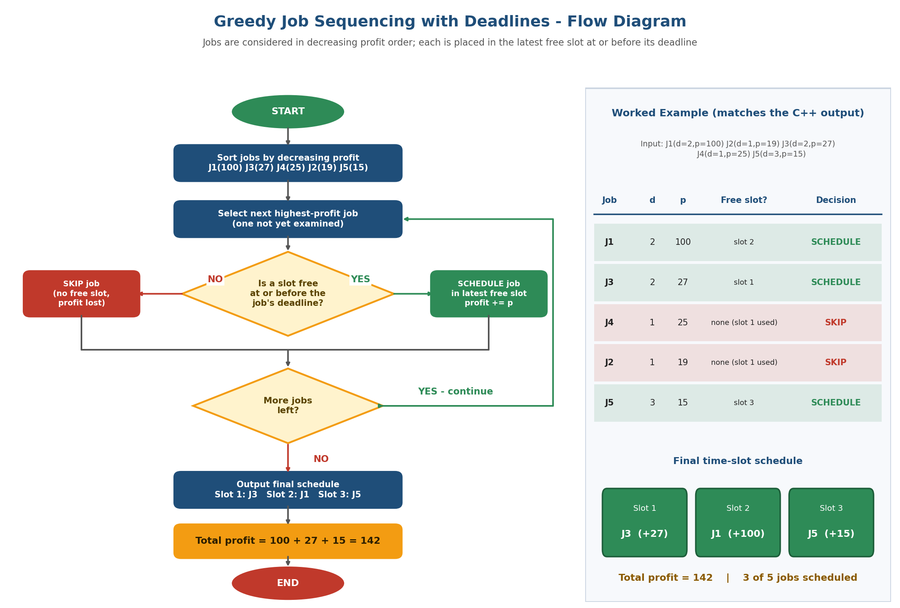

# Project 4 – Greedy Job Sequencing Flowchart

## Unit
**Unit II – Divide and Conquer & Greedy Method** (this project covers the *Greedy* part of the unit)

## Description
A C++ implementation of **Job Sequencing with Deadlines** using the greedy strategy. Every job takes one unit of time, has a deadline and a profit, and earns its profit only if it finishes on or before its deadline. The program sorts jobs by profit, places each job in the latest free slot not after its deadline, and reports the selected jobs and total profit. `Visualization.png` is a flowchart of this decision process together with the worked example.

## Problem Statement
Create a flow diagram showing job selection based on deadlines and profits.

## Algorithm
1. Sort all jobs in **decreasing order of profit**.
2. Let `D` be the maximum deadline; create `D` empty time slots.
3. For each job in the sorted order, look for a free slot starting at `min(D, deadline)` and moving left.
4. If a free slot is found, **schedule** the job there and add its profit; otherwise **skip** the job.
5. Output the final schedule and the total profit.

**Greedy choice:** always take the most profitable remaining job, and place it in the *latest* possible free slot so that earlier slots stay available for jobs with tighter deadlines.

## Pseudocode
```
JOB-SEQUENCING(jobs):
    sort jobs by profit in decreasing order
    D <- max deadline;  slot[1..D] <- empty
    totalProfit <- 0
    for each job j in sorted order:
        for t <- min(D, j.deadline) downto 1:
            if slot[t] is empty:
                slot[t] <- j
                totalProfit <- totalProfit + j.profit
                break                    // job scheduled
        // if no free slot was found, the job is skipped
    return slot[1..D], totalProfit
```

## Input
| Job | Deadline | Profit |
|-----|----------|--------|
| J1 | 2 | 100 |
| J2 | 1 | 19 |
| J3 | 2 | 27 |
| J4 | 1 | 25 |
| J5 | 3 | 15 |

## Output
```
Step 1: Jobs sorted by decreasing profit:
  J1 (deadline 2, profit 100)
  J3 (deadline 2, profit 27)
  J4 (deadline 1, profit 25)
  J2 (deadline 1, profit 19)
  J5 (deadline 3, profit 15)

Step 2: Greedy selection (latest free slot <= deadline):
  J1: slot 2 is free -> SCHEDULE (profit +100)
  J3: slot 1 is free -> SCHEDULE (profit +27)
  J4: no free slot <= deadline 1 -> SKIP
  J2: no free slot <= deadline 1 -> SKIP
  J5: slot 3 is free -> SCHEDULE (profit +15)

Final schedule:
  Slot 1 : J3
  Slot 2 : J1
  Slot 3 : J5

Selected jobs : J3 J1 J5
Jobs scheduled: 3 of 5
Total profit  : 142
```

## Prompt Used
The full prompt is stored in [`Prompt.txt`](Prompt.txt). Summary: *"Create a professional flowchart for greedy Job Sequencing with Deadlines: Start → sort by profit → select highest-profit job → is a slot free before the deadline? → schedule or skip → more jobs? → final schedule → total profit, with a worked-example panel."*

## Visualization


## Visualization Explanation
* The **left side** is the algorithm flowchart: Start → sort by profit → select next job → decision diamond *"Is a slot free at or before the deadline?"* → **YES** (green) schedule / **NO** (red) skip → decision *"More jobs left?"* → loop back, or output the final schedule and total profit → End.
* The **right panel** traces the sample input row by row and matches the program output exactly: J1, J3 and J5 are scheduled (green rows), J4 and J2 are skipped because slot 1 is already used (red rows).
* The three green boxes show the final timeline: Slot 1 = J3, Slot 2 = J1, Slot 3 = J5, total profit **142**.

## Complexity Analysis
| Step | Cost |
|------|------|
| Sorting jobs by profit | O(n log n) |
| Slot search for each job (at most D steps) | O(n · D) |
| **Total** | **O(n log n + n·D)**, i.e. O(n²) in the worst case (D ≤ n) |
| Space | O(D) for the slot array |

(The slot search can be reduced to near O(n log n) with a Disjoint Set Union structure.)

## Learning Outcome
* Understand the greedy-choice property and why sorting by profit works.
* Apply a greedy strategy to a scheduling/optimisation problem and justify the "latest free slot" rule.
* Convert an algorithm into a flowchart with decision and loop structures.
* Analyse the running time of a greedy algorithm.

## How to Run
```bash
g++ -std=c++17 -o Project4_JobSequencing Project4_JobSequencing.cpp
./Project4_JobSequencing          # Windows: Project4_JobSequencing.exe
```

## Files
| File | Purpose |
|------|---------|
| `Project4_JobSequencing.cpp` | Greedy job sequencing implementation |
| `Prompt.txt` | AI visualization prompt |
| `Visualization.png` | Flowchart + worked example |
| `README.md` | This document |
