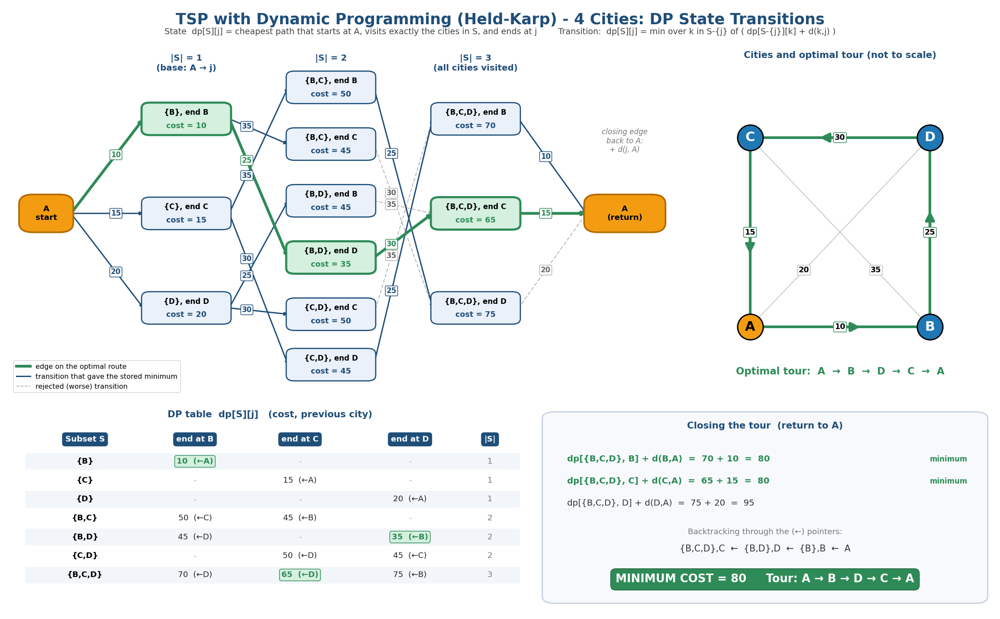

# Project 7 – Traveling Salesperson DP Table

## Unit
**Unit III – Dynamic Programming**

## Description
A Python implementation of the **Held–Karp dynamic-programming algorithm** for the Traveling Salesperson Problem (TSP) on 4 cities (A, B, C, D). Subsets of visited cities are stored as bit masks; the program computes every DP state, prints every state transition, finds the minimum tour cost and reconstructs the optimal route using parent pointers. The visualization shows the DP state-transition graph, the DP table and the final tour.

## Problem Statement
Visualize DP state transitions for TSP with 4 cities: find the shortest route that starts at city A, visits every city exactly once and returns to A.

## Algorithm
* **State:** `dp[S][j]` = minimum cost of a path that starts at A, visits exactly the cities in subset `S ⊆ {B, C, D}` and ends at city `j ∈ S`.
* **Base case:** `dp[{j}][j] = dist[A][j]`.
* **Transition:** `dp[S][j] = min over k ∈ S∖{j} of ( dp[S∖{j}][k] + dist[k][j] )`.
* **Answer:** `min over j of ( dp[{B,C,D}][j] + dist[j][A] )`.
* **Route:** follow the stored predecessor (parent) of each state backwards from the best last city.

## Pseudocode
```
HELD-KARP(dist, n):
    for each city j != A:
        dp[{j}][j] <- dist[A][j]
    for size <- 2 to n-1:
        for each subset S of the non-start cities with |S| = size:
            for each j in S:
                dp[S][j] <- min over k in S-{j} of ( dp[S-{j}][k] + dist[k][j] )
                parent[S][j] <- the k that gives the minimum
    best <- min over j of ( dp[ALL][j] + dist[j][A] )
    reconstruct the tour by following parent[][] back from the best j
    return best, tour
```

## Input
Distance matrix (symmetric):

|   | A | B | C | D |
|---|---|---|---|---|
| **A** | 0 | 10 | 15 | 20 |
| **B** | 10 | 0 | 35 | 25 |
| **C** | 15 | 35 | 0 | 30 |
| **D** | 20 | 25 | 30 | 0 |

## Output
```
DP states  dp[S][j]  (path starts at A, visits set S, ends at j):
  S={B}       | end B: 10
  S={C}       | end C: 15
  S={D}       | end D: 20
  S={B,C}     | end B: 50, end C: 45
  S={B,D}     | end B: 45, end D: 35
  S={C,D}     | end C: 50, end D: 45
  S={B,C,D}   | end B: 70, end C: 65, end D: 75

State transitions (12 total):
  dp[{C},C]=15  +  d(C,B)=35  ->  candidate for dp[{B,C},B] = 50
  ... (12 lines printed by the program) ...
  dp[{B,D},D]=35  +  d(D,C)=30  ->  candidate for dp[{B,C,D},C] = 65

Closing the tour (return to A):
  dp[{B,C,D},B] + d(B,A) = 70 + 10 = 80
  dp[{B,C,D},C] + d(C,A) = 65 + 15 = 80
  dp[{B,C,D},D] + d(D,A) = 75 + 20 = 95

Optimal tour : A -> B -> D -> C -> A
Minimum cost : 80
```
The tours `A→B→D→C→A` and its reverse `A→C→D→B→A` both cost 80 (`10+25+30+15`); they are the same cycle. The program breaks the tie toward the later last city, giving `A→B→D→C→A`.

## Prompt Used
The full prompt is stored in [`Prompt.txt`](Prompt.txt). Summary: *"Visualize the Held–Karp DP state transitions for TSP with 4 cities: a state graph grouped by subset size with transition costs, a DP table with predecessor pointers, the optimal tour on a city map, and the final minimum cost."*

## Visualization


## Visualization Explanation
* **State-transition graph (top-left):** each box is a DP state `{subset}, end city` with its cost. Columns are subset sizes |S| = 1, 2, 3. Arrows are the recurrence transitions labelled with `d(k,j)`; blue arrows gave the stored minimum, grey dashed arrows were rejected, and **green** arrows/boxes form the optimal path `A → {B} → {B,D},D → {B,C,D},C → A`.
* **DP table (bottom-left):** every `dp[S][j]` value with the predecessor city in brackets (e.g. `65 (←D)`); the optimal cells are highlighted.
* **City map (top-right):** the four cities (not drawn to scale) with the optimal tour `A→B→D→C→A`.
* **Result panel (bottom-right):** the three closing costs (80, 80, 95) and the final **minimum cost = 80**.

## Complexity Analysis
| Measure | Value |
|---------|-------|
| Number of states | (n−1) · 2ⁿ⁻² with the start city fixed (here 4 cities → 3 · 2² = 12 states) |
| Work per state | O(n) |
| **Time** | **O(n² · 2ⁿ)** |
| **Space** | **O(n · 2ⁿ)** |
| Brute force for comparison | O(n!) |

For this instance the program evaluates 12 transitions and 3 closing edges instead of enumerating all 3! = 6 orderings – the saving grows enormously with n.

## Learning Outcome
* Formulate a problem as DP states, base cases and a recurrence.
* Use bit masks to represent subsets of cities.
* Understand overlapping sub-problems and why Held–Karp beats O(n!) brute force.
* Reconstruct an optimal solution from DP parent pointers.

## How to Run
```bash
python Project7_TSP_DP.py
```
No external libraries are required (Python 3.8+).

## Files
| File | Purpose |
|------|---------|
| `Project7_TSP_DP.py` | Held–Karp TSP implementation with state/transition printing |
| `Prompt.txt` | AI visualization prompt |
| `Visualization.png` | DP state graph, DP table, tour map, final cost |
| `README.md` | This document |
