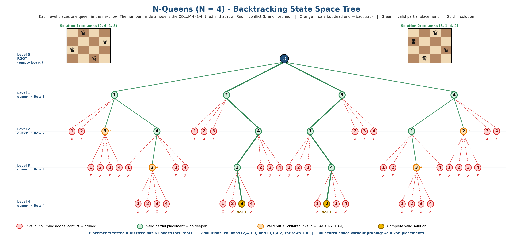

# Project 10 – N-Queens State Space Tree

## Unit
**Unit IV – Backtracking**

## Description
A Java program that solves the **4-Queens problem by backtracking**. Queens are placed row by row; each candidate square is tested with a safety check, unsafe squares are pruned and, when a row has no safe square left, the algorithm backtracks to the previous row. The program prints a full trace of the search, both solutions and their boards. The visualization draws the complete **state space tree** with invalid branches in red.

## Problem Statement
Visualize the state space tree for N = 4 queens, marking invalid branches in red.

## Algorithm
1. Start with an empty board (the root of the state space tree).
2. For row `r = 0 … N−1`, try each column `c = 0 … N−1` in order.
3. A placement is **safe** if no earlier queen is in the same column or on the same diagonal (`|col[i] − c| == |i − r|`).
4. If safe, place the queen and recurse to the next row; if unsafe, **prune** that branch.
5. If a row has no safe column, **backtrack**: remove the queen from the previous row and try its next column.
6. When all N rows are filled, record a solution.

## Pseudocode
```
SOLVE(row):
    if row = N:
        record solution ; return
    for c <- 0 to N-1:
        if IS-SAFE(row, c):
            col[row] <- c                 // place queen
            SOLVE(row + 1)                // go deeper
            // returning here = backtrack, try next column
        else:
            prune this branch

IS-SAFE(row, c):
    for r <- 0 to row-1:
        if col[r] = c  or  |col[r] - c| = |r - row|:
            return false
    return true
```

## Input
`N = 4` (a 4 × 4 board, one queen per row). No user input is required.

## Output
Excerpt of the trace (rows and columns are numbered from 0):
```
Row 0, col 0: SAFE -> place queen
  Row 1, col 0: UNSAFE -> prune (red)
  Row 1, col 1: UNSAFE -> prune (red)
  Row 1, col 2: SAFE -> place queen
    Row 2, col 0: UNSAFE -> prune (red)
    ...  (all four columns unsafe -> backtrack)
```
Summary and solutions printed by the program:
```
Total solutions      : 2
Placements tested    : 60 (tree nodes excluding the root)
Dead-end rows        : 4 (rows with no safe column)

Solution 1  (row,col, 1-indexed): (1,2) (2,4) (3,1) (4,3)
  . Q . .
  . . . Q
  Q . . .
  . . Q .

Solution 2  (row,col, 1-indexed): (1,3) (2,1) (3,4) (4,2)
  . . Q .
  Q . . .
  . . . Q
  . Q . .
```

## Prompt Used
The full prompt is stored in [`Prompt.txt`](Prompt.txt). Summary: *"Create a state space tree for 4-Queens by backtracking: root, one level per row, circles containing the column tried, invalid branches in red, backtracking marks, gold solution nodes, legend and solution boards."*

## Visualization


## Visualization Explanation
* The **root** (∅) is the empty board; **Level k** shows the column tried for the queen in **Row k**.
* **Red circles with dashed red edges (✗)** are invalid placements (column or diagonal conflict) – these branches are pruned immediately.
* **Green circles** are valid partial placements that are explored further; **orange circles with ↩** are valid placements whose four children are all red, so the search **backtracks** from them.
* **Gold circles (SOL 1, SOL 2)** are complete solutions; the thick green path from the root to each shows the placements `(2,4,1,3)` and `(3,1,4,2)`.
* The tree contains exactly **60 tested placements + the root = 61 nodes**, matching the Java counter, versus 4⁴ = 256 full placements without pruning. Row-1 columns 1 and 4 (and 2 and 3) are mirror images, which is why the tree is symmetric.

## Complexity Analysis
| Measure | Value |
|---------|-------|
| Worst-case time | O(N!) – at most N choices in row 1, N−1 in row 2, … after pruning (naïve space is Nᴺ) |
| Cost of one safety check | O(N) |
| Space | O(N) for the column array and recursion stack |
| N = 4 in practice | 60 placements tested, 2 solutions |

## Learning Outcome
* Understand the backtracking paradigm: choose, check constraints, recurse, undo.
* Represent the search as a state space tree and prune infeasible branches early.
* Encode the column and diagonal constraints of N-Queens.
* Compare pruned search with exhaustive search (60 vs 256 placements for N = 4).

## How to Run
```bash
javac Project10_NQueens.java
java Project10_NQueens
```
Requires JDK 8 or later.

## Files
| File | Purpose |
|------|---------|
| `Project10_NQueens.java` | Backtracking N-Queens with trace, solutions and counters |
| `Prompt.txt` | AI visualization prompt |
| `Visualization.png` | State space tree (invalid branches in red) |
| `README.md` | This document |
