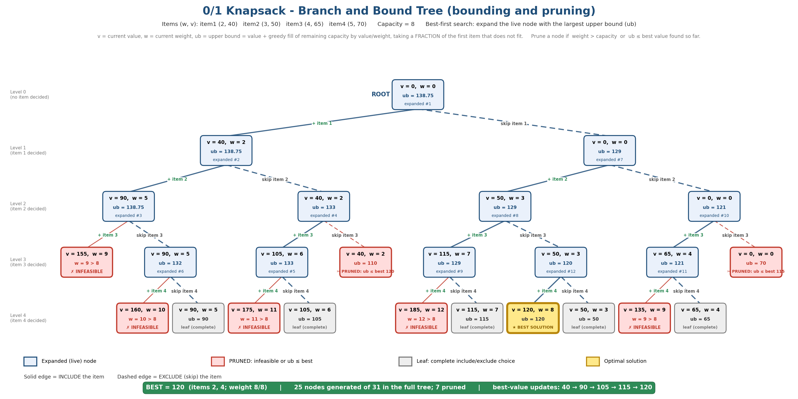

# Project 13 – Knapsack Branch-and-Bound Tree

## Unit
**Unit V – Branch and Bound**

## Description
A Python implementation of the **0/1 Knapsack problem using Branch and Bound** with best-first search. Each node stores its level, current weight, current value and an **upper bound** computed with the fractional-knapsack relaxation. Every node branches into *include* and *exclude* children; nodes that exceed the capacity or whose bound cannot beat the best solution found so far are **pruned**. The program prints a node table, and the visualization draws the resulting tree.

## Problem Statement
Illustrate bounding and pruning in 0/1 Knapsack using node values.

## Algorithm
1. Sort items by value/weight ratio (the sample is already sorted).
2. Create the root node (level 0, weight 0, value 0) and compute its **upper bound**: fill the remaining capacity with items in ratio order, taking a *fraction* of the first item that does not fit.
3. Keep live nodes in a max-priority queue ordered by upper bound (**best-first**).
4. Pop the node with the largest bound. If `bound ≤ best value`, **prune** it.
5. Otherwise branch on the next item: **include** it (prune if `weight > capacity`; update `best` if the value improves) and **exclude** it.
6. Push children whose bound is greater than the current best; stop when the queue is empty. The best value found is optimal.

## Pseudocode
```
KNAPSACK-BNB(w[], v[], W):
    best <- 0
    root <- node(level=0, weight=0, value=0);  root.bound <- BOUND(root)
    PQ <- max-heap ordered by bound;  PQ.push(root)
    while PQ not empty:
        u <- PQ.pop()
        if u.bound <= best: prune u ; continue
        i <- u.level
        // ---- include item i ----
        a <- node(i+1, u.weight + w[i], u.value + v[i])
        if a.weight > W:               prune a (infeasible)
        else:
            best <- max(best, a.value)
            if a.bound > best and a is not a leaf: PQ.push(a)
        // ---- exclude item i ----
        b <- node(i+1, u.weight, u.value)
        if b.bound > best and b is not a leaf: PQ.push(b)
    return best

BOUND(node):
    b <- node.value ; totalW <- node.weight
    for j <- node.level to n-1:
        if totalW + w[j] <= W:  totalW += w[j] ; b += v[j]
        else:  b += (W - totalW) * v[j] / w[j] ; break     // fractional part
    return b
```

## Input
| Item | 1 | 2 | 3 | 4 |
|------|---|---|---|---|
| Weight | 2 | 3 | 4 | 5 |
| Value | 40 | 50 | 65 | 70 |
| Value / weight | 20.00 | 16.67 | 16.25 | 14.00 |

Knapsack capacity **W = 8**.

## Output
Full node table printed by the program (`ub` = upper bound):
```
 ID Parent   Branch Lvl Weight Value    Bound  Status
  0      -     root   0      0     0   138.75  expanded (#1)
  1      0  include   1      2    40   138.75  expanded (#2)
  2      0  exclude   1      0     0   129.00  expanded (#7)
  3      1  include   2      5    90   138.75  expanded (#3)
  4      1  exclude   2      2    40   133.00  expanded (#4)
  5      3  include   3      9   155     0.00  PRUNED (weight > capacity)
  6      3  exclude   3      5    90   132.00  expanded (#6)
  7      4  include   3      6   105   133.00  expanded (#5)
  8      4  exclude   3      2    40   110.00  PRUNED (bound 110.00 <= best 120)
  9      7  include   4     11   175     0.00  PRUNED (weight > capacity)
 10      7  exclude   4      6   105   105.00  LEAF (complete solution)
 11      6  include   4     10   160     0.00  PRUNED (weight > capacity)
 12      6  exclude   4      5    90    90.00  LEAF (complete solution)
 13      2  include   2      3    50   129.00  expanded (#8)
 14      2  exclude   2      0     0   121.00  expanded (#10)
 15     13  include   3      7   115   129.00  expanded (#9)
 16     13  exclude   3      3    50   120.00  expanded (#12)
 17     15  include   4     12   185     0.00  PRUNED (weight > capacity)
 18     15  exclude   4      7   115   115.00  LEAF (complete solution)
 19     14  include   3      4    65   121.00  expanded (#11)
 20     14  exclude   3      0     0    70.00  PRUNED (bound 70.00 <= best 115)
 21     19  include   4      9   135     0.00  PRUNED (weight > capacity)
 22     19  exclude   4      4    65    65.00  LEAF (complete solution)
 23     16  include   4      8   120   120.00  LEAF (complete solution)  <== OPTIMAL
 24     16  exclude   4      3    50    50.00  LEAF (complete solution)

Best-value updates: node 1 -> 40, node 3 -> 90, node 7 -> 105, node 15 -> 115, node 23 -> 120

Optimal items  : [2, 4] (1-indexed)  weights [3, 5]  values [50, 70]
Total weight   : 8 / 8
Optimal value  : 120
Nodes generated: 25   pruned: 7   full tree would have 31
```
(For infeasible nodes the bound is not computed and is shown as 0.00.)

## Prompt Used
The full prompt is stored in [`Prompt.txt`](Prompt.txt). Summary: *"Create a Branch-and-Bound tree for 0/1 Knapsack (weights 2,3,4,5; values 40,50,65,70; capacity 8) showing include/exclude branches, value, weight and upper bound in every node, the best solution and clearly marked pruned nodes."*

## Visualization


## Visualization Explanation
* Each box shows `v` (current value), `w` (current weight) and `ub` (upper bound). **Solid edges** = include the item, **dashed edges** = skip it.
* **Blue boxes** are expanded nodes, numbered in the order the best-first search expanded them (#1 … #12).
* **Red boxes** are pruned: either **infeasible** (`w > 8`, e.g. `w = 9`, `10`, `11`, `12`) or **bounded out** (`ub = 110` and `ub = 70` are ≤ the best value 120 / 115 already known, so they cannot improve the answer).
* **Grey boxes** are complete assignments (leaves); the **gold box** is the optimal leaf `v = 120, w = 8` (items 2 and 4).
* The banner records the best value improving 40 → 90 → 105 → 115 → 120 and that 25 of the 31 possible nodes were generated (7 pruned).

Honest note: with only four items the bound cuts only part of the tree; the technique pays off much more as `n` grows.

## Complexity Analysis
| Measure | Value |
|---------|-------|
| Worst-case nodes | O(2ⁿ) – the full include/exclude tree has 2ⁿ⁺¹ − 1 nodes (31 for n = 4) |
| Cost per node | O(n) to compute the bound (O(log n) heap operations) |
| Practical behaviour | Pruning removes many subtrees; here 25 of 31 nodes were generated |
| Space | O(2ⁿ) worst case for the priority queue |

## Learning Outcome
* Understand branch and bound: branching, bounding and pruning.
* Compute an upper bound with the fractional-knapsack relaxation.
* Use best-first search with a priority queue and an incumbent (best-so-far) value.
* Distinguish pruning by infeasibility from pruning by bound, and read a state space tree.

## How to Run
```bash
python Project13_Knapsack_BnB.py
```
No external libraries are required (Python 3.8+).

## Files
| File | Purpose |
|------|---------|
| `Project13_Knapsack_BnB.py` | 0/1 Knapsack Branch and Bound with node table output |
| `Prompt.txt` | AI visualization prompt |
| `Visualization.png` | Branch-and-bound tree with pruned nodes marked |
| `README.md` | This document |
